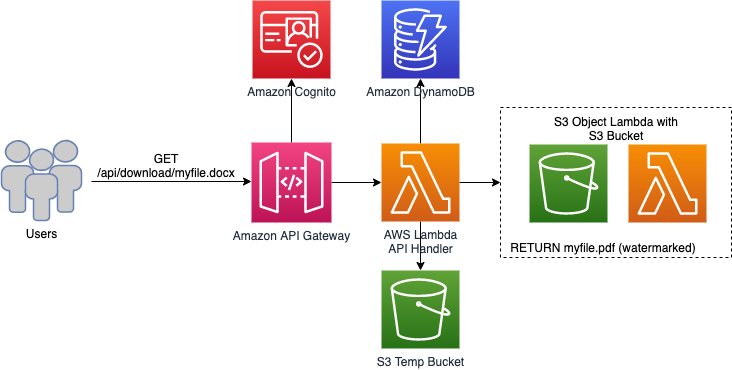
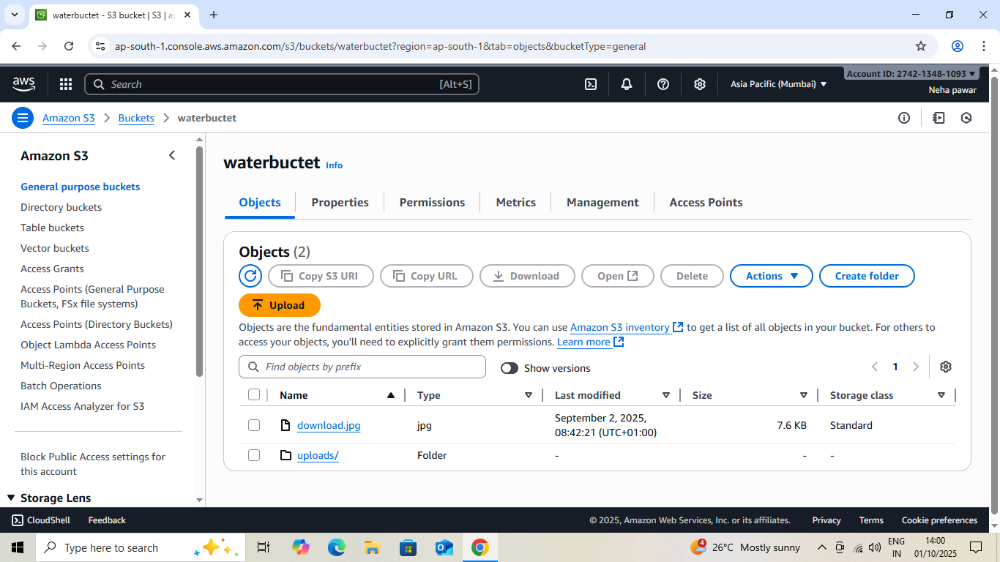
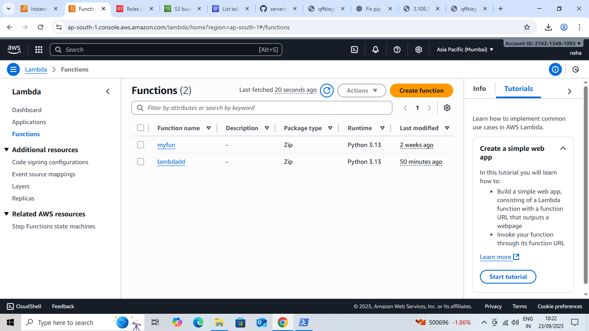
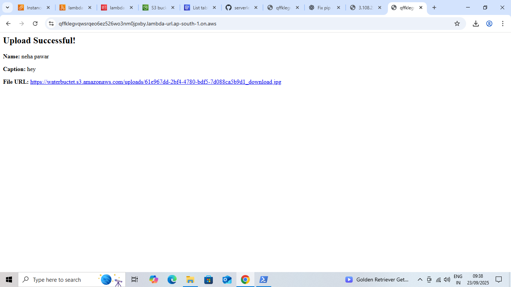

# Serverless Info Uploader – AWS Serverless File Upload System
## Project Introduction
### Serverless Info Uploader is a cloud-native application that enables secure file uploads to Amazon S3 with metadata storage in DynamoDB. The application generates temporary download links that automatically expire after 1 hour, ensuring enhanced security for file sharing.

#### This implementation follows a serverless architecture on AWS where:

#### Amazon S3 provides secure, scalable file storage

#### AWS Lambda handles serverless computation and business logic

#### Amazon DynamoDB stores file metadata and access information

#### AWS IAM manages secure access permissions

#### The architecture ensures cost-effectiveness, automatic scaling, and minimal maintenance overhead while maintaining high security standards.
## 1. Architecture Overview

## 2. AWS Services Configuration
## 2.1 S3 Bucket Setup
#### Name:waterbuctet 

#### Region: ap-south-1 (Asia Pacific - Mumbai)
#### Configuration: Private access with temporary URL generation Purpose: Secure file storage with expiration policies

### 2.2 DynamoDB Table Configuration

Table Name:reels 

Partition Key: id (String)

Capacity Mode: On-demand

Purpose: Stores file metadata including:S

Unique file ID

Original filename

Upload timestamp

Expiration time

S3 object reference

Download count

.png)
## 2.3 IAM Policies and Roles
#### Execution Role: AWSLambdaBasicExecutionRole
#### Managed Policies: AmazonDynamoDBFullAccess AmazonS3FullAccess
#### Purpose: Grants Lambda function necessary permissions to access S3 and DynamoDB
.png)
## 3. Application Workflow
### File Upload Process
1.User Interface: Web form for file selection and upload

2.Lambda Trigger: Upload event triggers Lambda function execution

3.S3 Storage: File is securely stored in S3 bucket with unique identifier

4.Metadata Recording: File information stored in DynamoDB table

5.URL Generation: Temporary download link created with 1-hour expiration

6.User Feedback: Success response with download link provided

### 4.Temporary URL Mechanism
Pre-signed S3 URLs with 1-hour expiration

No permanent public access to files

Secure sharing without exposing bucket contents

## Automatic cleanup of expired links
## 5. Security Features
### Access Control
IAM roles with least privilege principle

No public read/write access to S3 bucket

Fine-grained DynamoDB access controls
### 5.2 Data Protection
Temporary URLs with automatic expiration

No persistent public access to files

Secure metadata storage in DynamoDB

### 5.3 Monitoring and Logging
#### S3 access logging enabled
#### DynamoDB query logging
## 6.1 Deployment Steps
### 1. Infrastructure Setup
### Create S3 bucket
aws s3api create-bucket --bucket waterbuctet--region ap-south-1
### Create DynamoDB table
aws dynamodb create-table
--table-name reels \ --attribute-definitions AttributeName=id,AttributeType=S \--key-schema AttributeName=id,KeyType=HASH 
### 6.2 IAM Role Configuration

{
  "Version": "2012-10-17",
  "Statement": [
    {
      "Effect": "Allow",
      "Action": [
        "s3:PutObject",
        "s3:GetObject",
        "s3:DeleteObject"
      ],
      "Resource": "arn:aws:s3:::waterbuctet/*"
    },
    {
      "Effect": "Allow",
      "Action": [
        "dynamodb:PutItem",
        "dynamodb:GetItem",
        "dynamodb:UpdateItem",
        "dynamodb:DeleteItem"
      ],
      "Resource": "arn:aws:dynamodb:ap-south-1:*:table/reels"
    }
  ]
}
## 6.3 Lambda Function Deployment
#### Runtime: Python 3.9/Node.js 16.x
#### Handler: Process upload events
#### Environment variables:
 S3_BUCKET: waterbuctet
 

 DYNAMODB_TABLE: reels
 ## Lambda File
 
 ## Upload Success
 
 
 ## Cost Optimization
### Pay-per-use pricing for all services
### No idle resource costs with serverless architecture
### Automatic scaling based on demand
### No infrastructure maintenance required
# Summary
## By leveraging S3 for storage, Lambda for computation, DynamoDB for metadata, and IAM for security, this solution provides a maintainable and highly available file upload service without needing server management.
## This implementation follows best practices for serverless applications, including proper security configurations, error handling, and cost optimization while providing a seamless user experience for secure file sharing.